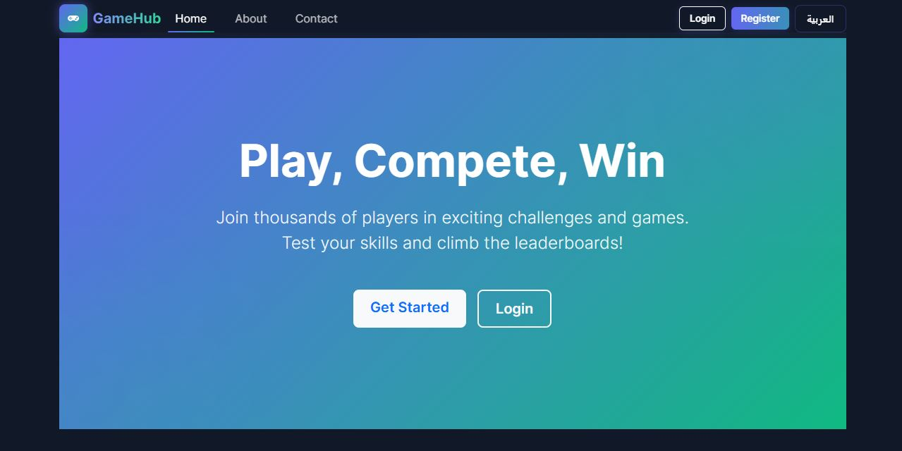
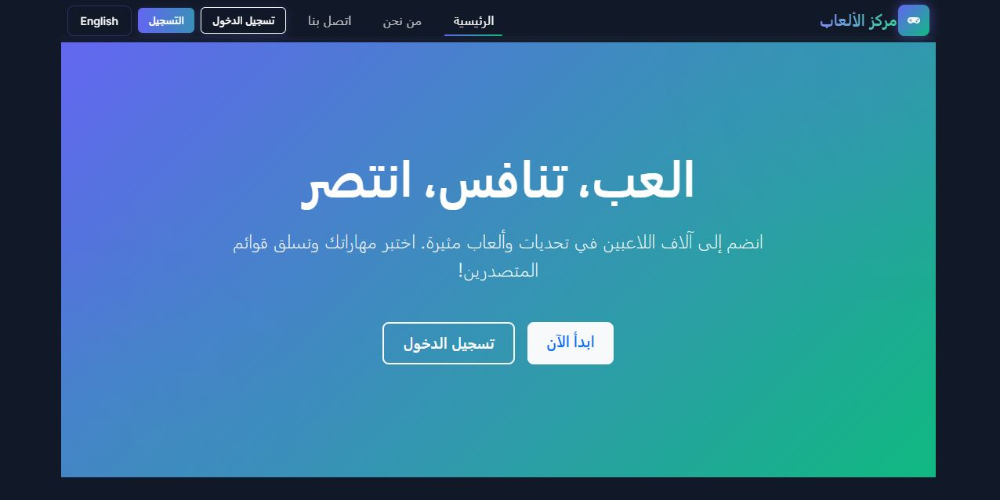

# GameHub - Interactive Gaming Platform

<p align="center">
  
  
  
  
</p>

## 🌟 Overview

GameHub is a modern, bilingual gaming platform that offers competitive gaming experiences for users of all skill levels. The platform features a seamless language switch between Arabic and English with full RTL support, modern glassmorphism UI, and an intuitive user experience.

<p align="center">
  
  
</p>

## ✨ Features

### 🌐 Bilingual Support
- Complete English and Arabic language translations
- Automatic RTL/LTR direction switching
- Seamless language toggling without page reloads

### 🎮 Gaming Experience
- Personalized game recommendations
- Tournament participation
- Progress tracking and leaderboards
- Multiple game categories (Puzzle, Math, Quiz, Memory, Typing)

### 👤 User Management
- User registration and authentication
- Persistent user sessions
- Personalized profiles
- Game history tracking

### 🎨 Modern UI Design
- Glassmorphism effects with backdrop blur
- Gradient animations and transitions
- Responsive layout for all devices
- Interactive hover effects and animations

## 🚀 Getting Started

### Prerequisites

- Node.js 16.x or higher
- npm or yarn

### Installation

```bash
# Clone the repository
git clone https://github.com/yourusername/game-platform.git

# Navigate to the project directory
cd game-platform

# Install dependencies
npm install

# Start the development server
npm run dev
```

## 🏗️ Project Structure

```
/src
  /assets        # Static assets and CSS
  /components    # Reusable UI components
  /context       # React context providers
  /locales       # Translation files
  /pages         # Application pages
  /utils         # Utility functions
```

## 🧩 Key Components

- **Language Switcher**: Toggle between English and Arabic with proper RTL support
- **Game Cards**: Display game information with hover effects and animations
- **Authentication Forms**: Modern, accessible login and registration forms
- **Tournament Section**: Special events and competitions

## 🎨 Design System

The platform uses a consistent design system featuring:

- **Color Palette**: Indigo primary, green secondary with dark blue/gray backgrounds
- **Typography**: Clean, readable fonts optimized for both Latin and Arabic scripts
- **Components**: Glass-effect cards, gradient buttons, and animated interactive elements
- **Animation**: Subtle hover effects, transitions, and loading states

## 📱 Responsive Design

GameHub is fully responsive, providing an optimal experience on:
- Desktops and laptops
- Tablets
- Mobile phones

## 🔄 Language Switching

The language system allows users to toggle between English and Arabic instantly, with proper RTL/LTR direction and appropriate font rendering for each language.

## 📝 License

This project is licensed under the MIT License - see the LICENSE file for details.

## 📧 Contact

For inquiries or contributions, please contact [fatmaelraey.22@gmail.com](mailto:fatmaelraey.22@gmail.com).
